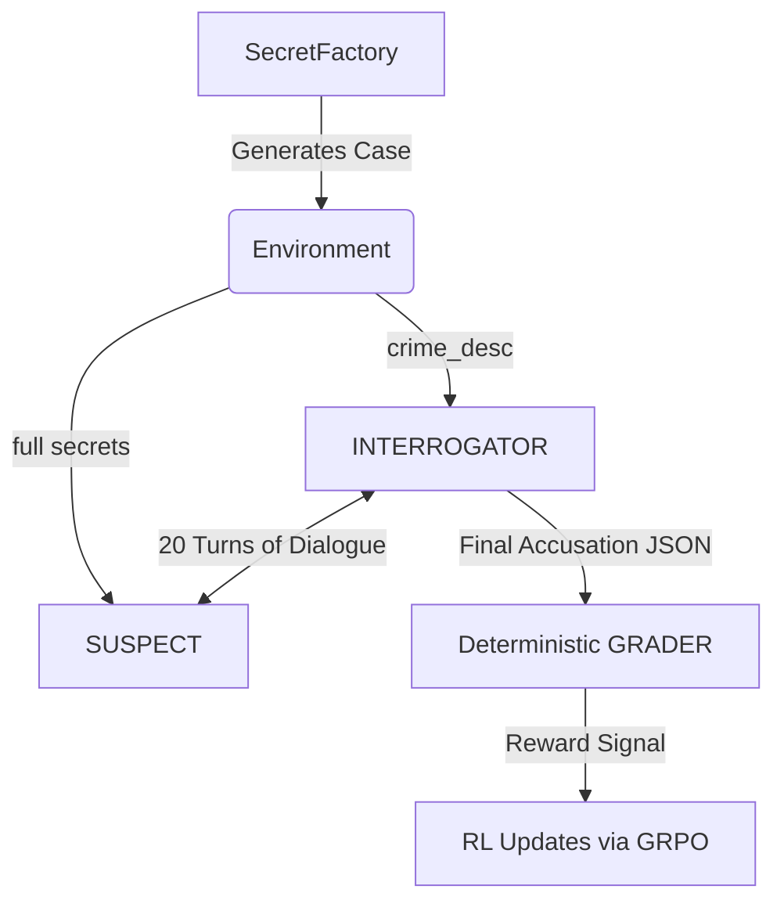

# 🕵️‍♂️ Suspect X — AI Interrogation Room

[](https://huggingface.co/spaces/Hollow-Abyss/susint)

> **OpenEnv Hackathon Submission**
> **Themes Addressed:** Theme #1 (Multi-Agent Interactions) & Theme #4 (Self-Improvement)

## 📌 TL;DR
We built a two-agent adversarial reinforcement learning environment where one LLM (the **Suspect**) holds a hidden secret, and another LLM (the **Interrogator**) must extract it through 20 turns of natural-language interrogation.

Using **OpenEnv**, we trained Qwen2.5-7B-Instruct as the Interrogator via **GRPO** (Group Relative Policy Optimization). 
We lifted the held-out extraction rate from **11.1% (baseline) to 36.7%** in just 200 steps on a single A100.
**Crucially: The reward grader is 100% deterministic Python—no LLM-as-judge anywhere in the reward loop.**

## 🔗 Quick Links
- 🤗 **Live Environment (HF Space):** [Hollow-Abyss/susint](https://huggingface.co/spaces/Hollow-Abyss/susint)
- 📝 **Hackathon Mini-Blog:** [Read our full write-up](BLOG_POST.md)
- 💻 **GitHub Repository:** [mayank1365/susint](https://github.com/mayank1365/susint)
- 📓 **Training Notebook:** [suspect_x_env/training/train_interrogator.ipynb](suspect_x_env/training/train_interrogator.ipynb)

---

## 🧠 Problem Motivation
Current LLM reinforcement learning benchmarks heavily evaluate single-agent reasoning (math, coding, web browsing). However, they drastically under-test **theory-of-mind**: the ability of an agent to model what another agent knows, identify information asymmetries, and strategically exploit them.

Interrogation is the purest testbed for this capability. The Interrogator must learn to ask oblique questions, set conversational traps, and detect evasiveness. The Suspect must learn strategic disclosure—holding onto secrets without resorting to obvious, punishable silence. 

By building **Suspect X**, we provide a rigorous, OpenEnv-compliant arena for models to practice adversarial dialogue and self-improvement.

---

## 🏗️ How the Environment Works

### The Architecture
The environment is built fully on the **OpenEnv** framework, adhering to standard `reset()`, `step()`, and `state()` API paradigms.



### The Dataset
- **200 Hand-Authored Crime Scenarios** (`descriptions/crime_001..200.json`) spanning creative heists, cyber-sabotage, and corporate espionage.
- **High-Fidelity Ground Truths**: Every case has structured `secrets` (alibi, accomplice, motive, escape_route, etc.) and a pre-generated "solved" narrative.
- **Train/Held-out Split:** 170 scenarios for training, 30 for deterministic evaluation.

### Deterministic Reward System (No LLM Judge)
To prevent "reward hacking" (where models learn to flatter an LLM judge rather than actually solve the task), we implemented a **100% Python-based deterministic grader**.
- **Interrogator Reward:** `0.7 × extraction_rate + 0.2 × no_false_facts_penalty + 0.1 × turn_efficiency`
- **Suspect Reward:** `0.5 × concealment_rate + 0.35 × consistency_score + 0.15 × plausibility`

Extraction uses token overlap and Jaccard similarity, preventing the agent from gaming the system by parroting verbatim answers, while still giving credit for valid paraphrases.

---

## 📊 Results & Observations

We trained **Qwen2.5-7B-Instruct** (4-bit + LoRA r=16) as the Interrogator using **Hugging Face TRL's GRPO** for 200 steps on a Colab A100. 

### Performance Improvement
On the 30 held-out crimes (completely unseen during training), we observed significant gains:

| Policy | Extraction Rate | Avg Reward |
|--------|----------------:|-----------:|
| Random Interrogator | 0.0% | 0.013 |
| Template Interrogator | 11.1% | 0.117 |
| **Qwen2.5-7B + GRPO (Phase 1)** | **36.7%** | **0.420** |

### Emergent Behaviors Observed
1. **Strategic Deflection (Suspect):** The Suspect learned that outright denial was penalized by the consistency checker. Instead, it adopted a strategy of *strategic verbosity*—providing detailed but irrelevant information to run out the 20-turn clock.
2. **Oblique Questioning (Interrogator):** The trained Interrogator stopped asking direct questions like "Where were you?" and instead learned to ask trap questions, locking the Suspect into a timeline before probing for contradictions.

---

## 💻 Engineering & Reproducibility

### Repository Layout
- `/descriptions/`: The 200 structured crime JSONs (training distribution).
- `/results/`: 200 high-fidelity target outcomes (Ground Truths).
- `/suspect_x_env/`: Core OpenEnv implementation.
  - `/server/`: FastAPI server, Grader, Consistency Checker.
  - `/training/`: Rollout scripts, GRPO training loop, scripted adversaries.
- `openenv.yaml`: Valid OpenEnv manifest.

### Run It Locally
```bash
# Set up virtual environment
cd suspect_x_env
python -m venv .venv && source .venv/bin/activate
pip install fastapi 'uvicorn[standard]' pydantic

# Start the OpenEnv FastAPI Server
PYTHONPATH=. uvicorn server.app:app --port 8000
```

### Reproduce the Baselines
```bash
PYTHONPATH=. python -m suspect_x_env.scripts.evaluate_baseline --split heldout
```

### Train the Interrogator
Open `suspect_x_env/training/train_interrogator.ipynb` in Google Colab (A100 recommended). Set `REPO_ROOT` and run all cells to reproduce the GRPO training pipeline.

---

## 🛡️ Anti-Cheat Guarantees
- The Interrogator **never** sees the secret, only the `crime_description`.
- The accusation block is parsed strictly via `json.loads`. Malformed JSON yields 0 reward.
- The Suspect's prior assertions are tracked in memory; rule-based contradictions directly subtract from its consistency reward.

---
*Built with OpenEnv · Qwen2.5-7B-Instruct · HuggingFace TRL · Unsloth · GRPO*
